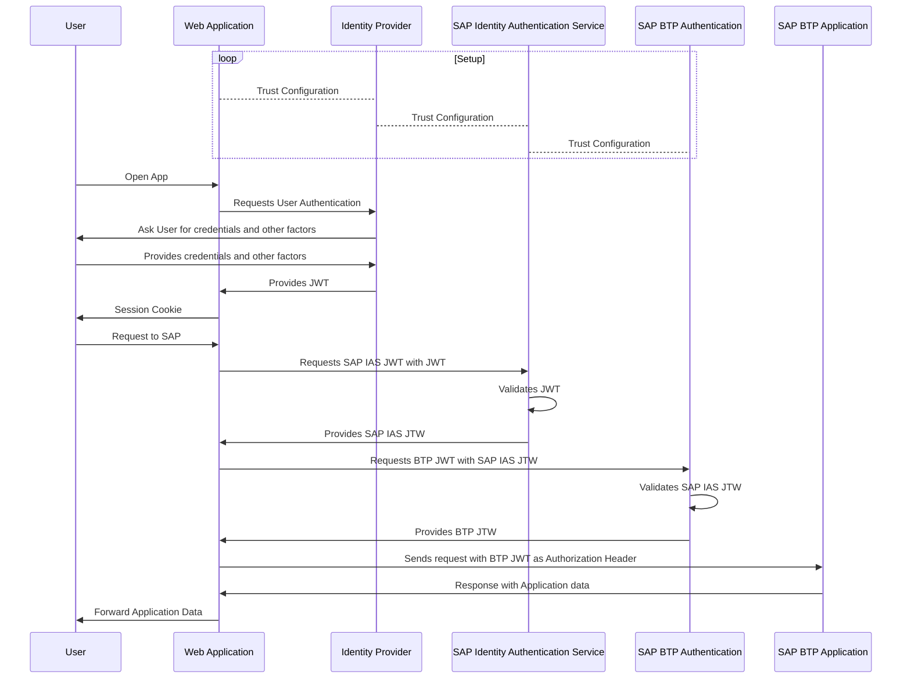

## OAuth Token Exchange Flow

Configuration based on the SAP Community blog posts:

- [Exchange JWT token from Azure with token issued by SAP Cloud Identity Authentication Service](https://community.sap.com/t5/technology-blogs-by-sap/exchange-jwt-token-from-azure-with-token-issued-by-sap-cloud-identity/ba-p/13553444)
- [Connecting SAP IAS as a proxy to Azure AD using OpenID Connect](https://community.sap.com/t5/technology-blogs-by-members/connecting-sap-ias-as-a-proxy-to-azure-ad-using-openid-connect/ba-p/13534385)

