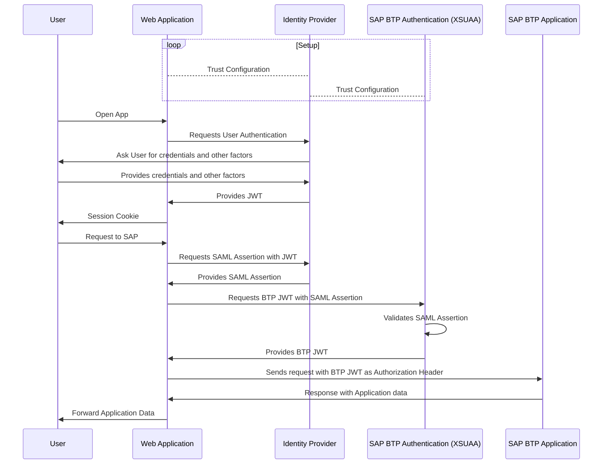
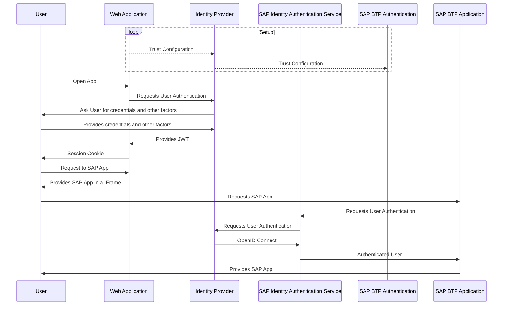

# Options to embed SAP BTP Applications in Web Applications

## OAuth SAML Bearer Assertion Flow

```mermaid
sequenceDiagram
%% participants
participant User as User
participant WebApp as Web Application
participant IdP as Identity Provider
participant XSUAA as SAP BTP Authentication (XSUAA)
participant BTPApp as SAP BTP Application
%% arrows
loop Setup
WebApp-->IdP: Trust Configuration
IdP-->XSUAA: Trust Configuration
end
User->>WebApp: Open App
WebApp->>IdP: Requests User Authentication
IdP->>User: Ask User for credentials and other factors
User->>IdP: Provides credentials and other factors
IdP->>WebApp: Provides JWT
WebApp->>User: Session Cookie
User->>WebApp: Request to SAP
WebApp->>IdP: Requests SAML Assertion with JWT
IdP->>WebApp: Provides SAML Assertion
WebApp->>XSUAA: Requests BTP JWT with SAML Assertion
XSUAA->>XSUAA: Validates SAML Assertion
XSUAA->>WebApp: Provides BTP JWT
WebApp->>BTPApp: Sends request with BTP JWT as Authorization Header
BTPApp->>WebApp: Response with Application data
WebApp->>User: Forward Application Data
```

## Embed SAP BTP App in Web Application

```mermaid
sequenceDiagram
%% participants
participant User as User
participant WebApp as Web Application
participant IdP as Identity Provider
participant SAPIAS as SAP Identity Authentication Service
participant XSUAA as SAP BTP Authentication
participant BTPApp as SAP BTP Application
%% arrows
loop Setup
WebApp-->>IdP: Trust Configuration
IdP-->>XSUAA: Trust Configuration
end
User->>WebApp: Open App
WebApp->>IdP: Requests User Authentication
IdP->>User: Ask User for credentials and other factors
User->>IdP: Provides credentials and other factors
IdP->>WebApp: Provides JWT
WebApp->>User: Session Cookie
User->>WebApp: Request to SAP App
WebApp->>User: Provides SAP App in a IFrame
User->>BTPApp: Requests SAP App
BTPApp->>SAPIAS: Requests User Authentication
SAPIAS->>IdP: Requests User Authentication
IdP->>SAPIAS: OpenID Connect
SAPIAS->>BTPApp: Authenticated User
BTPApp->>User: Provides SAP App
```
